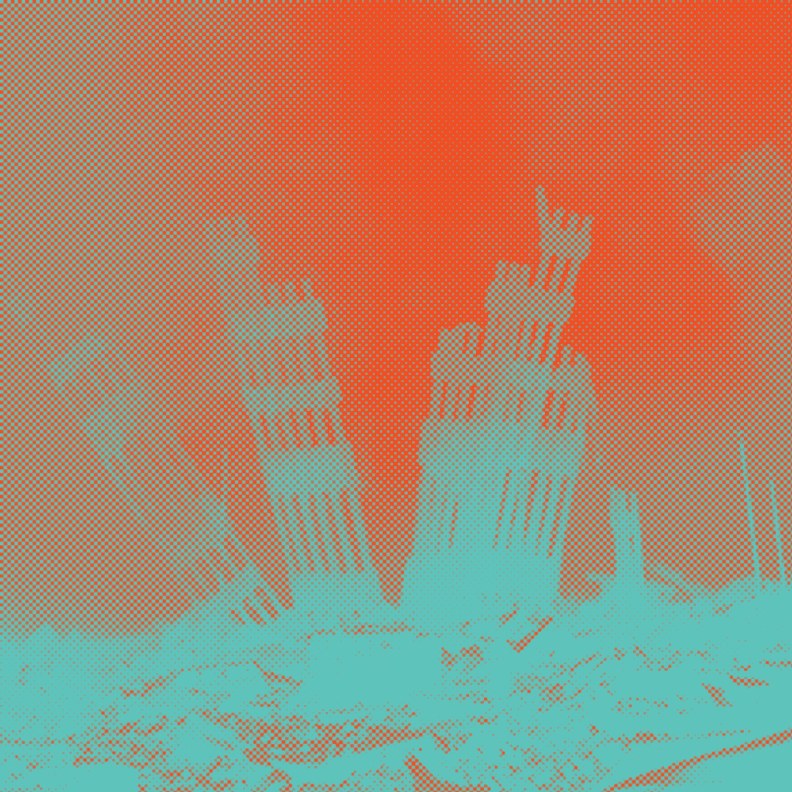
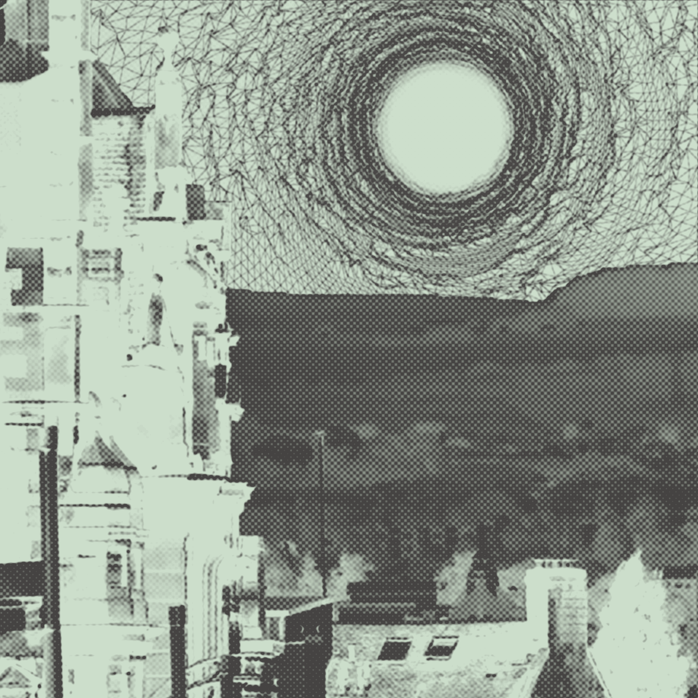
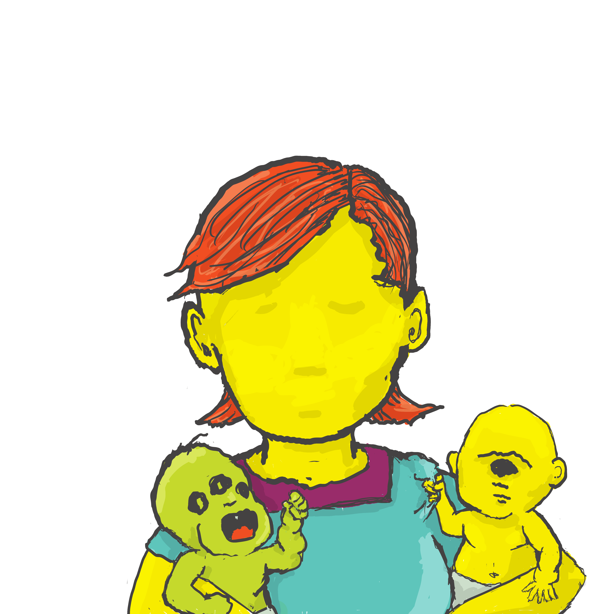
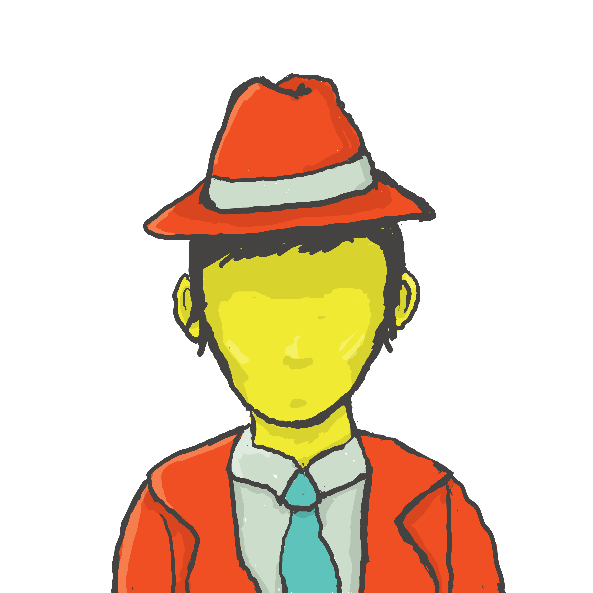
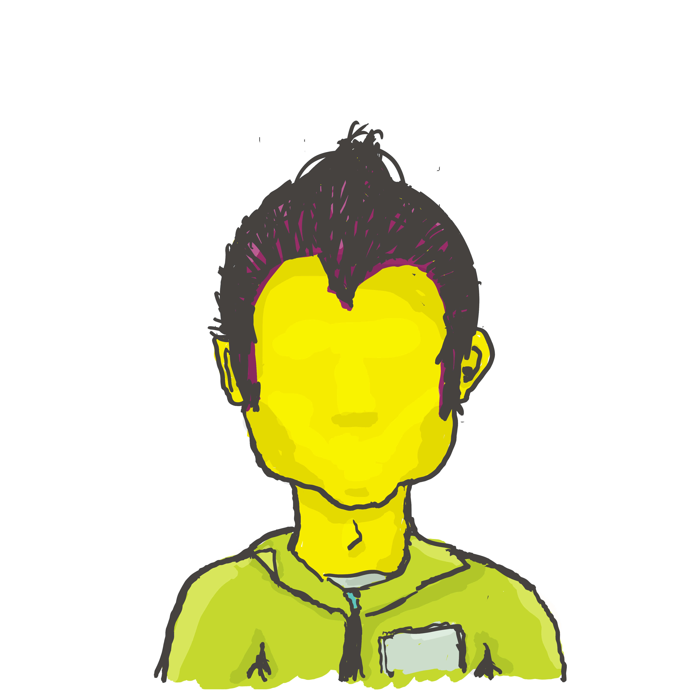
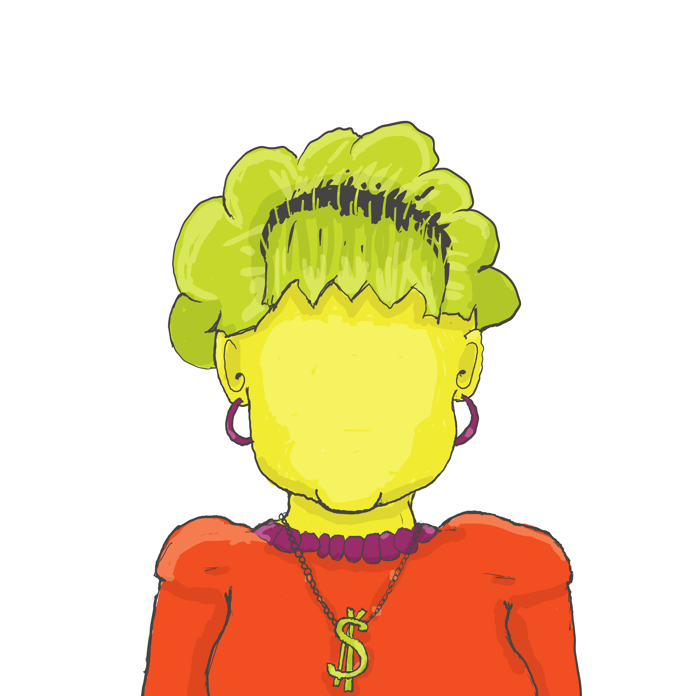
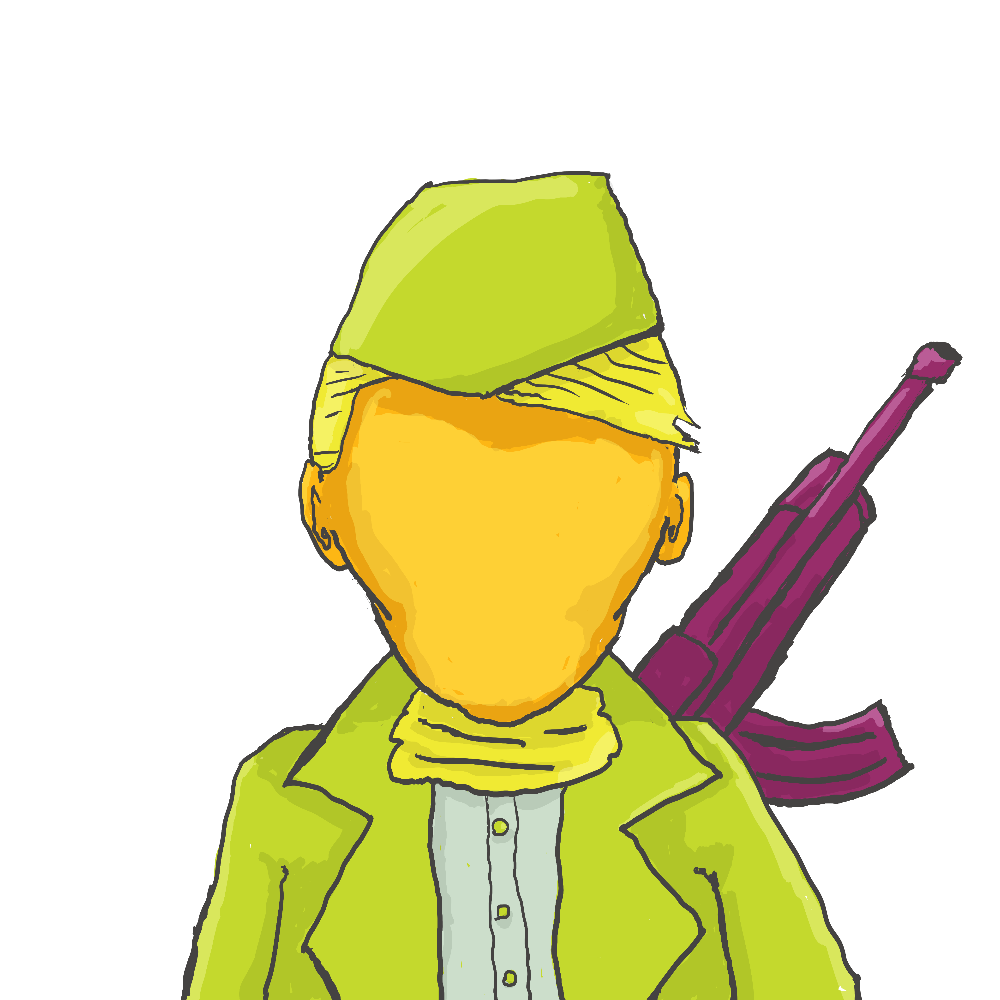

# Pulsar Palace Role Playing Game Rules

## Introduction
Pulsar Palace is a single-module, purpose-built role-playing game to accompany the album of the same title. It takes a hallucinogenic dimension that only appears in the consciousness of people looking at RGB monitors. In the milliseconds in which a person perceives the color yellow between Red and Green flickering this world is created, lived, and destroyed.

## Object of the Game
Get your party through the Pulsar Palace, a surreal and dangerous environment, to reach the core and unlock its secrets. Along the way, you will encounter bizarre creatures, solve puzzles, and navigate through shifting landscapes.

## Character Creation
Roll 1D10 for a time and place of origin:
| Time | Place         | Image |
|1 |2121 | New York City |   |
|2 |1953 | Hollywood |  |
|3 |2084 | Glasgow |  |
|4 |1973 | London |  |
|5 |1865 | Paris |  |
|6 |1949 | Berlin |  |
|7 |1937 | Milan |  |
|8 |1992 | Mexico City |  |
|9 |1982 | Hong Kong |  |
|10 |1727 | Baghdad |  |

Role 1D8 for a disposition:
| Dice Role | Disposition | Image |
| 1 |Angry |  |
| 2 |Curious |  |
| 3 |Misguided |  |
| 4 |Clumsy |  |
| 5 |Cursed |  |
| 6 |Sick |  |
| 7 |Vengeful |  |
| 8 |Crazed |  |

Roll 1D10 for a profession:
| Dice Role | Profession | Image |
| 1 | Doctor |  |
| 2 | Sailor |  |
| 3 | Breeder |  |
| 4 | Detective |  |
| 5 | Janitor |  |
| 6 | Spy |  |
| 7 | Librarian |  |
| 8 | Inventor |  |
| 9 | Tax Collector |  |
| 10 | Partisan |  |

(Note you can layer these transparent PNGs to make your character image Setting + Profession + Disposition)

Roll 2D10 for your starting On and Off stats, you can reroll once if you want. If your on/off stats are equal, add 1D10 to one of them.

## Game Mechanics
- There's only two stats: On and Off
- If On and Off are equal, you are in stasis and cannot act, this is true for player characters and NPCs.
- The DM decides if the player's action is large, medium, or small, and whether it is On or Off.
- They offer the target of the player's action such as an NPC, object, or difficulty level the opposite of the player's action and its own independent size.
- The action taker rolls 1D10 and the target rolls 1D8.
- If the action is small add 1/2 of the player's on/off stat rounded up, medium add 1/4 rounded up, and large add nothing.
- If the target is small subtract 1/2 of the target's on/off stat rounded up, medium subtract 1/4 rounded up, and large subtract nothing.
- If the actioner's total is higher than the target's total, the action succeeds.
- If the action fails, the actioner loses 1 point in the relevant stat (On or Off).
- Some objects on touch and rooms one enter can increase or decrease your On or Off stats.
- The DM only needs to control and track NPCs that the players have encountered.
- Movement is always a small action
- Players and NPCs roll initiative with 1D10 + 1/2 of their lowest On/Off stat rounded up, highest goes first.

## Winning the Game
The game ends when the players reach the Great Chamber and then escape through the back garden gate. If all players are in stasis, the game ends and they have lost.